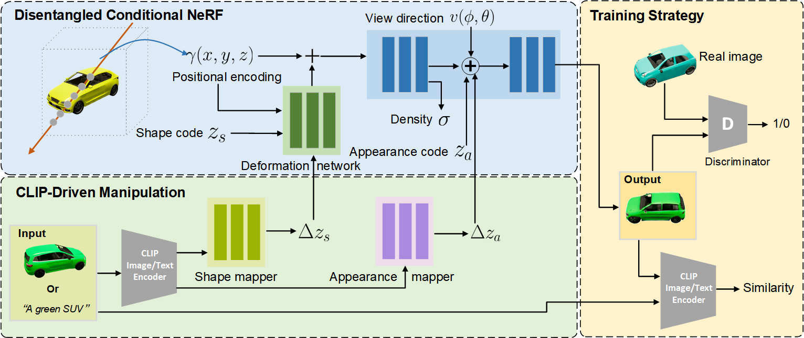

# CVPR2022: CLIP-NeRF: Text-and-Image Driven Manipulation of Neural Radiance Fields

### [Project Page](https://cassiepython.github.io/clipnerf/) | [Paper (ArXiv)](https://arxiv.org/abs/2112.05139)

[Can Wang](https://cassiepython.github.io/)1,
[Menglei Chai](https://mlchai.com/)2,
[Mingming He](http://mingminghe.com/)3,
[Dongdong Chen](http://www.dongdongchen.bid/)4,
[Jing Liao](https://liaojing.github.io/html/)1  
1City University of Hong Kong, 2Creative Vision, Snap Inc., 3USC Institute for Creative Technologies, 4Microsoft Cloud AI

## Abstract

We present CLIP-NeRF, a multi-modal 3D object manipulation method for neural radiance fields (NeRF). By leveraging the joint language-image embedding space of the recent Contrastive Language-Image Pre-Training (CLIP) model, we propose a unified framework that allows manipulating NeRF in a user-friendly way, using either a short text prompt or an exemplar image. Specifically, to combine the novel view synthesis capability of NeRF and the controllable manipulation ability of latent representations from generative models, we introduce a disentangled conditional NeRF architecture that allows individual control over both shape and appearance. This is achieved by performing the shape conditioning via applying a learned deformation field to the positional encoding and deferring color conditioning to the volumetric rendering stage. To bridge this disentangled latent representation to the CLIP embedding, we design two code mappers that take a CLIP embedding as input and update the latent codes to reflect the targeted editing. The mappers are trained with a CLIP-based matching loss to ensure the manipulation accuracy. Furthermore, we propose an inverse optimization method that accurately projects an input image to the latent codes for manipulation to enable editing on real images. We evaluate our approach by extensive experiments on a variety of text prompts and exemplar images and also provide an intuitive interface for interactive editing.

## Supplyment

I add the code of the single NeRF color editing in the supplyment directory. 
